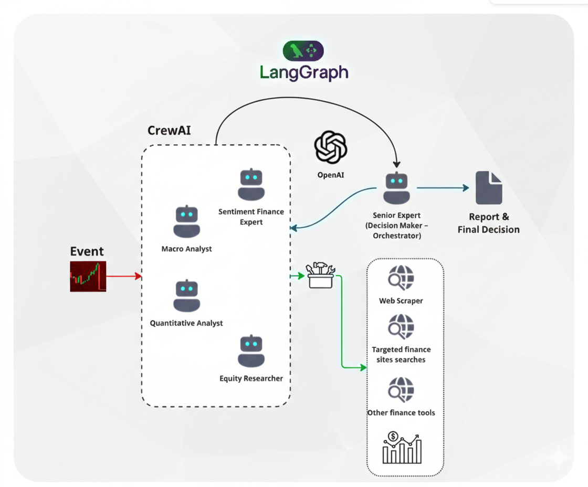

# 📈 MarketPulse: Event-Driven Multi-Agent Analyst

MarketPulse is a real-time stock market analysis engine. It listens to live market triggers via WebSockets, processes significant volatility events through a **RabbitMQ** queue, and orchestrates a specialized **CrewAI** team using **LangGraph** to deliver deep investment insights.

## 🏗️ Architecture Overview

The system is built on a high-concurrency, asynchronous pipeline:

1.  **Ingestion Layer**: A WebSocket client monitors live price streams. When a "Substantial Event" (defined as a >X% price move) is detected, it publishes a message to RabbitMQ.
2.  **Messaging Layer**: **RabbitMQ** acts as the buffer, ensuring no market event is lost during high volatility and allowing the analysis engine to scale horizontally.
3.  **Orchestration Layer (LangGraph)**: A Python consumer retrieves messages and triggers a state-machine. It manages the lifecycle of the analysis, including quality checks and loops.
4.  **Agentic Layer (CrewAI)**: Inside a LangGraph node, a "Crew" of several analysts with different personalities and roles performs deep research using web tools.
5.  **API Layer (FastAPI)**: Provides endpoints for real-time monitoring, manual triggers, and system status.

---

## 🚀 Key Features

-   **Persona-Diverse Analysis**: Simultaneously get high-risk, balanced, and defensive perspectives on market movers.
-   **Structured Reasoning**: The Orchestrator uses Pydantic-based decision making to ensure analysts' reports meet quality thresholds before finalizing.
-   **State Persistence**: Built-in LangGraph checkpointers allow you to resume analysis even after a service restart.
-   **Low Latency**: FastAPI and `aio-pika` (RabbitMQ) provide an entirely asynchronous non-blocking stack.

---

## 🛠️ Tech Stack

-   **Orchestration**: LangGraph
-   **Agents**: CrewAI
-   **Messaging**: RabbitMQ (amqp)
-   **API**: FastAPI
-   **Real-time**: WebSockets
-   **Models**: TBD

---

## 📋 Prerequisites

-   Python 3.12+
-   RabbitMQ Server (Local or CloudAMQP)
-   API Keys: OpenAI/Anthropic, Serper.dev and Tavily (for Search Tools)

---